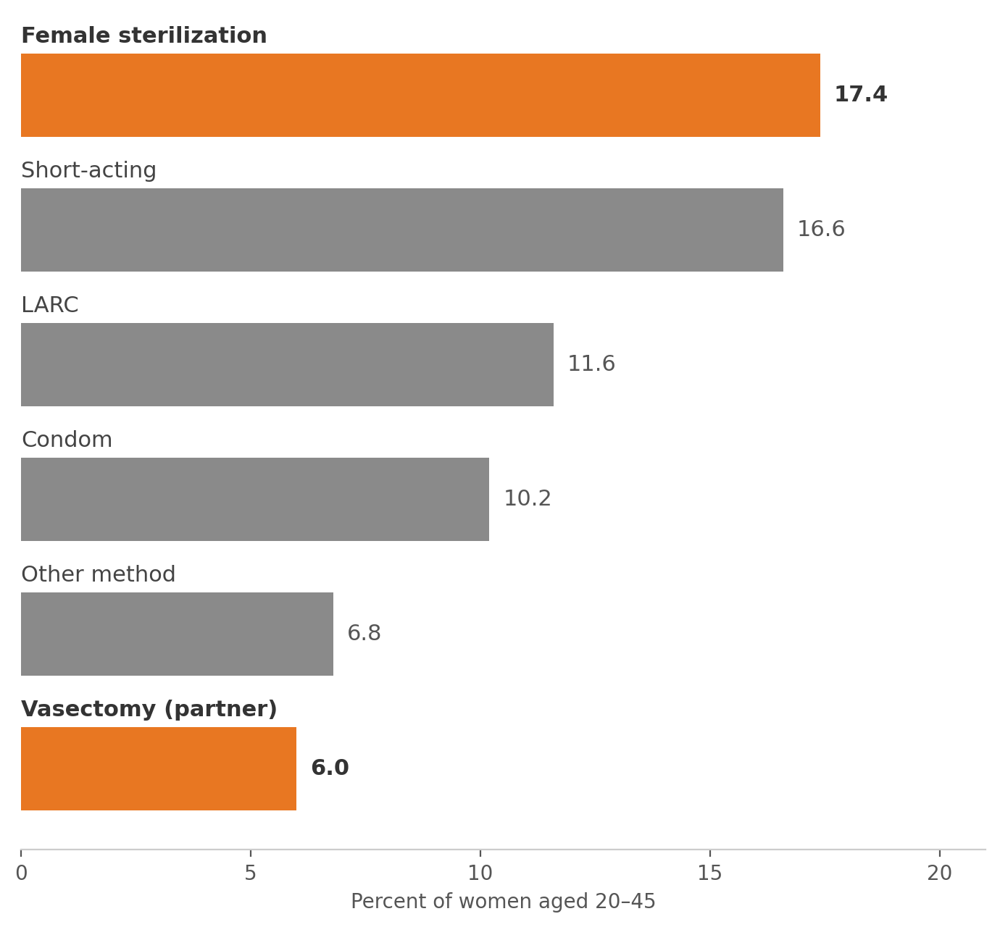
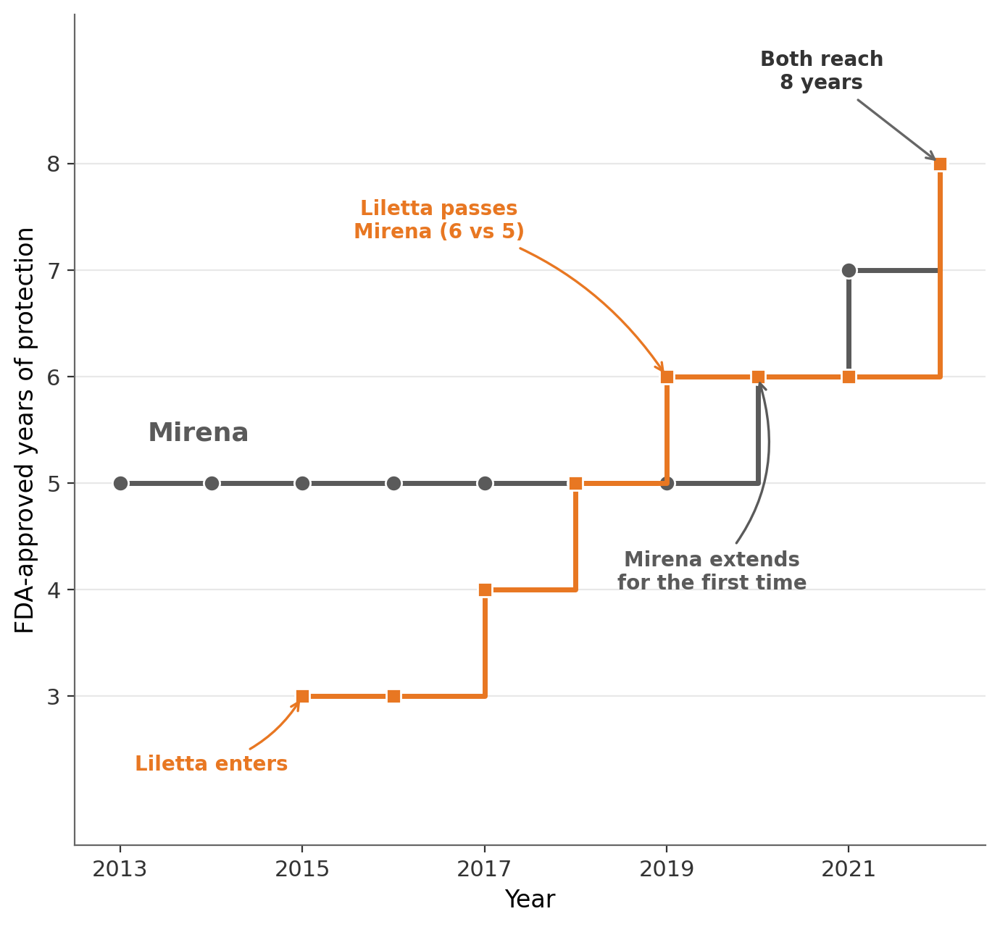

::: {.grid}

::: {.g-col-12 .g-col-md-8}

# Camille Wixon

PhD Candidate in Economics  
University of Virginia

Health Economics · Labor Economics · Industrial Organization

[caw2va@virginia.edu](mailto:caw2va@virginia.edu) · [CV](files/Camille_Wixon_CV.pdf){target="_blank"}

I am a PhD candidate in Economics at the University of Virginia. My research is in health economics with a focus on contraceptive markets.

I am on the academic job market for 2026–2027.

:::

::: {.g-col-12 .g-col-md-4}

:::

:::

## Job Market Paper

::: {.grid}

::: {.g-col-12 .g-col-md-8}

**The Price of Permanence: A Study of Household Contraceptive Choice including Sterilization**

Last updated: November 2025

*In 2015–2017, 18.6% of women aged 15–49 relied on female sterilization for contraception, while 4.0% of men aged 18–44 had undergone vasectomies (NSFG). Despite its prevalence, sterilization has received little attention in the economics literature. The Affordable Care Act's contraceptive mandate requires coverage of female sterilization but imposes no equivalent requirement for vasectomies, leaving men facing substantial out-of-pocket costs. Motivated by this policy asymmetry, this paper estimates the effect of price on male sterilization uptake using a nested logit model and MarketScan claims data on 30 million households from 2015–2017. Counterfactual simulations reveal that mandated vasectomy coverage would increase annual uptake by about 289%. These findings carry fiscal and health implications: relative to female sterilization, vasectomies are less costly, less invasive, and have lower rates of unintended pregnancy, suggesting that expanding the mandate could reduce both the cost and medical burden of permanent contraception.*

<!-- Uncomment when ready: [PDF](files/wixon_jmp.pdf) · [Slides](files/wixon_jmp_slides.pdf) -->

:::

::: {.g-col-12 .g-col-md-4}

Contraceptive method use among women aged 20–45, 2015–2019 (NSFG).

:::

:::

## Working Papers

::: {.grid}

::: {.g-col-12 .g-col-md-8}

**Refills and Renewals: Hassle Costs in the Contraceptive Market**

Last updated: November 2025

*After two decades, Mirena, the most widely used hormonal IUD in the United States, revised the approved duration of its device for the first time following the entry of a competitor, extending the period of protection a single insertion provides without any change to the device itself. Over the same years, 21 states began allowing pharmacists to prescribe self-administered contraception without a physician visit. Both changes reduced the hassle costs associated with obtaining and maintaining contraception. I use Medicaid State Drug and Utilization data from 2015–2022 to estimate a nested logit model of contraceptive demand, exploiting the staggered adoption of state pharmacy access laws and changes in the labeled duration of intrauterine devices. I find that pharmacy access increases the share of self-administered contraception by approximately 3.5 percentage points while an additional year of labeled protection increases a hormonal IUD's share within the hormonal IUD nest by 20–40 percentage points. I then examine how firm choices shape these characteristics and find a pattern suggestive of strategic extension, where competing products extend their labeled duration toward their clinically supported ceiling, while products without close rivals do not. Finally, in a counterfactual where the competitor never entered, I find that Mirena would not have extended its label beyond six years, resulting in approximately 128,000 fewer women per year in a long-acting method.*

<!-- Uncomment when ready: [PDF](files/wixon_iud.pdf) · [Slides](files/wixon_iud_slides.pdf) -->

:::

::: {.g-col-12 .g-col-md-4}

FDA-approved duration of Mirena and Liletta, 2013–2022.

:::

:::

## Works in Progress

**Ammunition stockpiling and gun regulation** (with Marcella Cartledge and Yiren Ding)